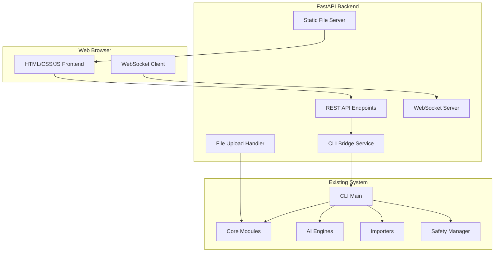

# Design Document

## Overview

The Smart Web GUI Interface is a FastAPI-based web application that provides a comprehensive graphical interface for the Linkwarden Enhancer system. The design follows a modern web architecture with a Python FastAPI backend serving both API endpoints and static HTML/CSS/JavaScript frontend files. The interface automatically discovers and exposes CLI functionality through dynamic introspection, eliminating the need for manual synchronization between CLI and web features.

The system uses a lightweight, dependency-minimal approach with vanilla JavaScript for the frontend, avoiding Node.js complexity while providing a responsive, feature-rich user experience. The design emphasizes real-time feedback, progressive enhancement, and mobile-first responsive design principles.

## Architecture

### High-Level Architecture



### Component Architecture

The system consists of three main architectural layers:

1. **Presentation Layer**: HTML/CSS/JavaScript frontend with responsive design
2. **API Layer**: FastAPI application with REST endpoints and WebSocket support
3. **Integration Layer**: CLI bridge service that dynamically discovers and executes CLI functionality

### Technology Stack

- **Backend**: FastAPI (Python 3.8+)
- **Frontend**: Vanilla HTML5, CSS3, JavaScript (ES6+)
- **Real-time Communication**: WebSockets for progress updates
- **File Handling**: FastAPI file upload with streaming support
- **Styling**: CSS Grid/Flexbox with CSS custom properties
- **Charts**: Chart.js for data visualization
- **Icons**: Feather Icons or similar lightweight icon set

## Components and Interfaces

### 1. FastAPI Web Server (`gui/server.py`)

**Purpose**: Main web server that serves the GUI and provides API endpoints

**Key Responsibilities**:
- Serve static HTML/CSS/JS files
- Provide REST API endpoints for all operations
- Handle file uploads and downloads
- Manage WebSocket connections for real-time updates
- Bridge between web interface and existing CLI functionality

**Interface**:
```python
class WebGUIServer:
    def __init__(self, config: Dict[str, Any])
    async def start_server(self, host: str = "127.0.0.1", port: int = 8000)
    async def shutdown_server(self)
    
    # API endpoint handlers
    async def get_dashboard_data(self) -> Dict[str, Any]
    async def upload_file(self, file: UploadFile) -> Dict[str, Any]
    async def process_bookmarks(self, request: ProcessRequest) -> Dict[str, Any]
    async def export_data(self, format: str, data: Dict) -> StreamingResponse
```

### 2. CLI Bridge Service (`gui/cli_bridge.py`)

**Purpose**: Dynamically discovers CLI functionality and executes commands

**Key Responsibilities**:
- Introspect CLI argument parser to discover available commands
- Convert web requests to CLI command execution
- Capture CLI output and progress for web display
- Handle CLI errors and convert to web-friendly responses

**Interface**:
```python
class CLIBridge:
    def __init__(self, cli_instance: MainCLI)
    def discover_commands(self) -> Dict[str, CommandInfo]
    async def execute_command(self, command: str, args: Dict) -> ExecutionResult
    def get_command_schema(self, command: str) -> Dict[str, Any]
    
@dataclass
class CommandInfo:
    name: str
    description: str
    arguments: List[ArgumentInfo]
    subcommands: List[str]

@dataclass
class ExecutionResult:
    success: bool
    output: str
    error: Optional[str]
    progress: Optional[ProgressInfo]
```

### 3. WebSocket Manager (`gui/websocket_manager.py`)

**Purpose**: Manages real-time communication for progress updates and notifications

**Key Responsibilities**:
- Handle WebSocket connections and disconnections
- Broadcast progress updates to connected clients
- Send real-time notifications and alerts
- Manage connection state and reconnection logic

**Interface**:
```python
class WebSocketManager:
    def __init__(self)
    async def connect(self, websocket: WebSocket, client_id: str)
    async def disconnect(self, client_id: str)
    async def send_progress_update(self, client_id: str, progress: ProgressUpdate)
    async def broadcast_notification(self, notification: Notification)
    
@dataclass
class ProgressUpdate:
    operation_id: str
    progress: float
    status: str
    message: str
    eta: Optional[int]
```

### 4. File Handler (`gui/file_handler.py`)

**Purpose**: Manages file uploads, processing, and downloads

**Key Responsibilities**:
- Handle multipart file uploads with progress tracking
- Validate file formats and sizes
- Provide secure temporary file storage
- Generate downloadable exports in multiple formats

**Interface**:
```python
class FileHandler:
    def __init__(self, config: Dict[str, Any])
    async def handle_upload(self, file: UploadFile) -> UploadResult
    async def validate_file(self, file_path: Path) -> ValidationResult
    async def generate_export(self, data: Dict, format: str) -> ExportResult
    def cleanup_temp_files(self, max_age: int = 3600)
    
@dataclass
class UploadResult:
    file_id: str
    filename: str
    size: int
    format: str
    validation_status: str
```

### 5. Frontend Application (`gui/static/`)

**Structure**:
```
gui/static/
├── index.html              # Main application shell
├── css/
│   ├── main.css           # Main stylesheet
│   ├── components.css     # Component-specific styles
│   └── responsive.css     # Mobile/tablet responsive styles
├── js/
│   ├── app.js            # Main application logic
│   ├── api.js            # API communication layer
│   ├── websocket.js      # WebSocket handling
│   ├── components/       # UI component modules
│   │   ├── dashboard.js
│   │   ├── file-upload.js
│   │   ├── progress.js
│   │   └── settings.js
│   └── utils/
│       ├── validation.js
│       └── formatting.js
└── assets/
    ├── icons/            # SVG icons
    └── images/           # Images and logos
```

**Key Frontend Components**:

- **Dashboard Component**: Main overview with system status and quick actions
- **File Upload Component**: Drag-and-drop file upload with progress
- **Process Monitor**: Real-time progress tracking with WebSocket updates
- **Settings Panel**: Configuration management with form validation
- **Export Manager**: Multi-format export with download handling
- **Visualization Components**: Charts and graphs for data analysis

## Data Models

### Web-Specific Data Models

```python
@dataclass
class WebRequest:
    """Base class for web API requests"""
    operation_id: str
    timestamp: datetime
    client_id: str

@dataclass
class ProcessRequest(WebRequest):
    """Request for bookmark processing operations"""
    input_data: Dict[str, Any]
    options: ProcessingOptions
    output_format: str

@dataclass
class ProcessingOptions:
    """Options for bookmark processing"""
    enable_ai_analysis: bool = True
    enable_scraping: bool = True
    enable_duplicate_detection: bool = True
    enable_enhancement: bool = True
    dry_run: bool = False
    batch_size: int = 100

@dataclass
class WebResponse:
    """Base class for web API responses"""
    success: bool
    message: str
    data: Optional[Dict[str, Any]] = None
    error: Optional[str] = None
    timestamp: datetime = field(default_factory=datetime.now)

@dataclass
class DashboardData:
    """Data for dashboard display"""
    system_status: SystemStatus
    recent_operations: List[OperationSummary]
    statistics: Dict[str, Any]
    available_commands: List[CommandInfo]

@dataclass
class SystemStatus:
    """Current system status information"""
    cpu_usage: float
    memory_usage: float
    disk_usage: float
    active_operations: int
    last_backup: Optional[datetime]
    ai_models_available: bool
```

### Configuration Models

```python
@dataclass
class WebGUIConfig:
    """Configuration for web GUI"""
    host: str = "127.0.0.1"
    port: int = 8000
    debug: bool = False
    max_file_size: int = 100 * 1024 * 1024  # 100MB
    temp_dir: str = "temp"
    static_dir: str = "gui/static"
    cors_origins: List[str] = field(default_factory=list)
    websocket_timeout: int = 300
    session_timeout: int = 3600
```

## Error Handling

### Error Categories

1. **Validation Errors**: Invalid input data or file formats
2. **Processing Errors**: Failures during bookmark processing operations
3. **System Errors**: Resource constraints or system-level failures
4. **Network Errors**: WebSocket disconnections or API timeouts
5. **Authentication Errors**: Invalid credentials or expired sessions

### Error Response Format

```python
@dataclass
class ErrorResponse:
    error_code: str
    error_message: str
    details: Optional[Dict[str, Any]] = None
    suggestions: List[str] = field(default_factory=list)
    retry_possible: bool = False
    
    def to_dict(self) -> Dict[str, Any]:
        return {
            "error": {
                "code": self.error_code,
                "message": self.error_message,
                "details": self.details,
                "suggestions": self.suggestions,
                "retry_possible": self.retry_possible
            }
        }
```

### Error Handling Strategy

- **Graceful Degradation**: Continue operation when non-critical components fail
- **User-Friendly Messages**: Convert technical errors to actionable user guidance
- **Retry Logic**: Automatic retry for transient failures with exponential backoff
- **Error Logging**: Comprehensive error logging for debugging and monitoring
- **Recovery Options**: Provide clear recovery paths for common error scenarios

## Testing Strategy

### Unit Testing

- **Backend Components**: Test all FastAPI endpoints, CLI bridge functionality, and data models
- **Frontend Components**: Test JavaScript modules using Jest or similar framework
- **Integration Points**: Test CLI integration and WebSocket communication

### Integration Testing

- **End-to-End Workflows**: Test complete user workflows from upload to export
- **API Integration**: Test all API endpoints with various input scenarios
- **WebSocket Communication**: Test real-time updates and connection handling

### Performance Testing

- **File Upload Performance**: Test large file uploads and processing
- **Concurrent Users**: Test multiple simultaneous users and operations
- **Memory Usage**: Monitor memory consumption during large operations
- **Response Times**: Ensure API response times meet performance requirements

### Browser Testing

- **Cross-Browser Compatibility**: Test on Chrome, Firefox, Safari, and Edge
- **Mobile Responsiveness**: Test on various mobile devices and screen sizes
- **Accessibility**: Test with screen readers and keyboard navigation
- **Progressive Enhancement**: Test functionality with JavaScript disabled

### Test Data and Scenarios

- **Sample Bookmark Files**: Various formats and sizes for testing
- **Error Scenarios**: Invalid files, network failures, and system errors
- **Performance Scenarios**: Large datasets and concurrent operations
- **Security Scenarios**: File upload security and input validation

The testing strategy ensures reliability, performance, and usability across all supported platforms and use cases, with particular attention to the integration between the new web interface and existing CLI functionality.